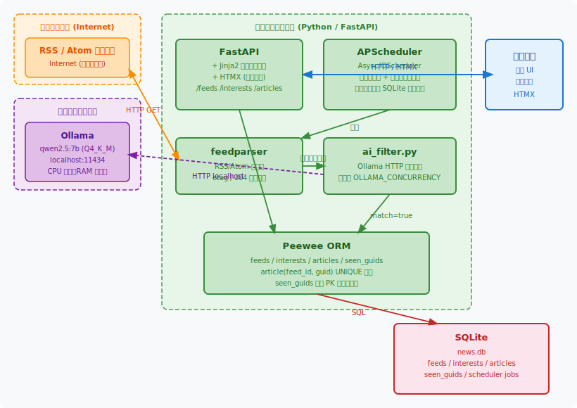
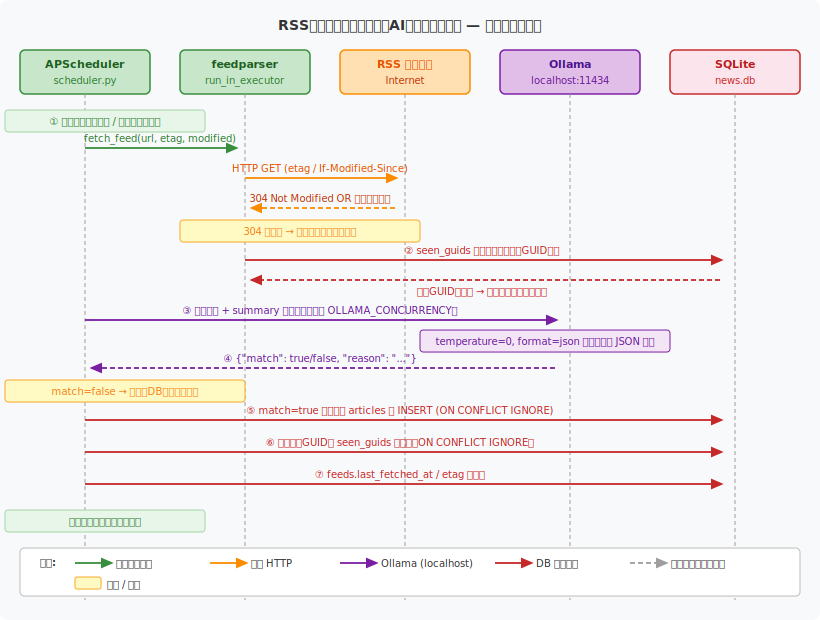

# News RSS Collector — 概要設計書

## 概要

RSS/Atom フィードを定期取得し、ローカル LLM（Ollama）によるフィルタリングを経て「興味のある記事だけ」を SQLite に保存するローカルアプリケーション。設定・閲覧用の Web UI をブラウザで提供する。外部 API への依存ゼロで動作する。

---

## システム構成図



---

## 通信フロー図（ポーリングサイクル）



---

## 技術スタック

| レイヤー | 選定 | 根拠 |
|---|---|---|
| RSS パーサー | `feedparser` | RSS 0.9x〜2.0 / Atom 全方言対応。etag / `If-Modified-Since` による差分取得で帯域節約 |
| スケジューラ | `APScheduler (AsyncIOScheduler)` | asyncio ネイティブ。ジョブを SQLite に永続化し、再起動後も継続。起動時に即時実行 |
| Web フレームワーク | `FastAPI` + `Jinja2` | 非同期対応・OpenAPI 自動生成。テンプレートでサーバーサイドレンダリング |
| フロントエンド強化 | `HTMX` | JS フレームワーク不要でページ部分更新。ビルドステップなし |
| ORM / DB | `Peewee` + `SQLite` | ローカル単一ユーザー用途に適切な軽量 ORM |
| AI フィルタ | `Ollama` + `qwen2.5:7b` | ローカル LLM。外部 API 不要・ランニングコストゼロ。CPU 推論対応 |

---

## DBスキーマ

```sql
-- 購読フィード
CREATE TABLE feed (
    id            INTEGER PRIMARY KEY,
    url           TEXT NOT NULL UNIQUE,
    name          TEXT NOT NULL,
    interval_min  INTEGER DEFAULT 60,
    enabled       INTEGER DEFAULT 1,
    last_fetched_at DATETIME,
    etag          TEXT,
    last_modified TEXT
);

-- 興味の方向性（自然文で記述）
CREATE TABLE interest (
    id          INTEGER PRIMARY KEY,
    name        TEXT NOT NULL,
    description TEXT NOT NULL  -- 例: "機械学習・LLM・AIエージェントに関する最新研究"
);

-- 保存された記事（AI判定通過済み）
CREATE TABLE article (
    id           INTEGER PRIMARY KEY,
    feed_id      INTEGER REFERENCES feed(id),
    guid         TEXT NOT NULL,
    title        TEXT NOT NULL,
    summary      TEXT,
    url          TEXT NOT NULL,
    published_at DATETIME,
    ai_reason    TEXT,   -- ローカルLLMの判定理由
    saved_at     DATETIME DEFAULT CURRENT_TIMESTAMP,
    UNIQUE (feed_id, guid)  -- DB レベルの重複排除安全網
);

-- 重複排除用（判定不合格記事も含む全既読GUID。ただし LLM 呼び出しが
--   一時エラー（タイムアウト等）になった記事は登録せず、次回リトライする）
CREATE TABLE seenguid (
    feed_id INTEGER REFERENCES feed(id),
    guid    TEXT NOT NULL,
    PRIMARY KEY (feed_id, guid)
);
```

---

## AIフィルタリング詳細

### フィルタリング方式

Ollama の `/api/chat` エンドポイントを `httpx.AsyncClient` で呼び出す。`format: "json"` オプションで JSON 出力を強制し、`temperature: 0` で判定の一貫性を確保。`num_predict` は判定理由（日本語1文）が途中で切れて JSON が壊れないよう余裕を持たせる（256）。

```
[System]
あなたはニュース記事の関連性を判定するアシスタントです。
ユーザーの興味は以下の通りです：

1. 機械学習・LLM・AIエージェントに関する最新研究
2. 国内外の株式市場・経済指標・金融政策に関するニュース
...（interest テーブルの内容）

記事のタイトルと要約を受け取り、次のJSONのみを返してください：
{"match": true, "reason": "判定理由（日本語・1文）"}
または
{"match": false, "reason": "判定理由（日本語・1文）"}

[User]
タイトル: {title}
要約: {summary}
```

### 並列制御

Ollama はシングルプロセスのため、`asyncio.Semaphore(OLLAMA_CONCURRENCY)` で同時リクエスト数を制限（デフォルト 2）。このセマフォは **module レベルでプロセス全体に 1 つだけ生成・共有** する。呼び出しごとに生成すると、複数フィードが同時にポーリングされたとき `OLLAMA_CONCURRENCY × フィード数` 本のリクエストが Ollama に殺到し、キューが溢れてタイムアウトの連鎖を起こすため。

### エラーハンドリング

LLM 呼び出しの失敗を 2 種類に分けて扱う。

| 種類 | 例 | 扱い |
|---|---|---|
| 一時エラー（transient） | タイムアウト・接続失敗・HTTP 5xx | `seenguid` に登録せず、次回ポーリングでリトライ |
| 出力解析エラー | モデルが壊れた JSON を返す | no-match 扱いで `seenguid` に登録（再試行しても直りにくいため無限ループを防ぐ） |

### 重複排除の多層構造

| レイヤー | 仕組み | 効果 |
|---|---|---|
| `seenguid` 複合 PK | AI 判定前に既処理 GUID を除外 | AI へのリクエスト自体を削減 |
| `article` UNIQUE(feed_id, guid) | INSERT 時の DB 制約 | 万一のすり抜けを DB レベルで防止 |
| APScheduler max_instances=1 | 同一フィードの並列実行を防止 | 競合状態を排除 |

---

## ディレクトリ構成

```
news/
├── app/
│   ├── main.py              # FastAPI エントリポイント、ルーティング
│   ├── models.py            # Peewee モデル定義
│   ├── scheduler.py         # APScheduler + RSS ポーリングロジック
│   ├── ai_filter.py         # Ollama HTTP 呼び出し、フィルタリングロジック
│   ├── seed.py              # 初期データ（フィード・興味）の冪等シード
│   ├── templates/
│   │   ├── base.html        # 共通レイアウト（HTMX 読み込み）
│   │   ├── feeds.html       # フィード管理 UI
│   │   ├── interests.html   # 興味設定 UI
│   │   └── articles.html    # 記事一覧・検索
│   └── static/
├── data/
│   └── news.db              # SQLite ファイル（gitignore）
├── docs/
│   ├── system-architecture.svg
│   └── communication-flow.svg
├── pyproject.toml
├── .env                     # 設定（gitignore）
├── .env.example             # 設定テンプレート
├── restart.sh               # サーバー再起動スクリプト
├── reset.sh                 # seenguid + article クリア + etag リセット（再収集用）
├── README.md
└── DESIGN.md                # 本ドキュメント
```

---

## 主要な設計判断

| 判断 | 内容 |
|---|---|
| ローカル LLM | Ollama + qwen2.5:7b を採用。外部 API コストゼロ。CPU 推論のみで動作するため GPU 不要 |
| 起動時の時間差ポーリング | サーバー起動直後に全フィードを取得するが、`FEED_START_STAGGER_SEC` 秒ずつ開始をずらす（`next_run_time = now + index × stagger`）。全フィード同時取得による LLM への一斉リクエストを防ぎつつ、60分待ちも排除 |
| 同期パーサーの非同期化 | `feedparser` は同期 I/O のため `loop.run_in_executor` でスレッドプールに逃がし、イベントループをブロックしない。`feedparser` 自体はネットワークタイムアウトを持たないため、`socket.setdefaulttimeout(FEED_FETCH_TIMEOUT)` を設定し、応答しないフィードがワーカースレッドを占有し続けるのを防ぐ |
| 重複排除の分離 | `seenguid` を独立テーブルにすることで、AI に落とされた記事も「既読」として扱い、再処理を防ぐ。ただし LLM 呼び出しが一時エラーになった記事は既読にせず、次回リトライする |
| インタレスト定義の粒度 | 自然文 1〜数文で記述。LLM がコンテキストを解釈するため、タグ・キーワード管理より柔軟 |
| URL スキーム検証 | `http://` / `https://` のみ受け付け、`file://` 等の SSRF を防止 |
